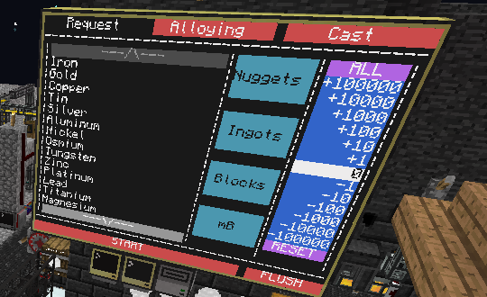

# ComputerCraftSmeltery
Automated Tinkers' Construct smeltery via ComputerCraft that I made in 2019 when I played the Minecraft 1.7 Project Ozone 2 modpack.

Also contains custom-made GUI framework and modem libraries, all written in Lua.

- `smeltery.lua` is intended to be run on a ComputerCraft computer connected to a smeltery, monitor, and bundled cables. It provides a touch-screen interface to request precise amounts of molten ore in the smeltery (or any liquid), create alloys and cast items. Casting is done using turtles controlled wirelessly by the main computer running this program.
- `extract.lua` is intended to be run on a ComputerCraft turtle that can communicate wirelessly with the main smeltery and execute casting commands it receives.
- `UI.lua` is a fairly feature-rich custom GUI framework for ComputerCraft displays. In it, one can create nested elements, clickable buttons, scrollable elements, event handlers and change all kinds of properties and visuals.
- `Modem.lua` is not as feature-rich as originally intended, but it is still useful here. It manages wireless communication through modems and allows paralel communication on a single channel as well as replying to specific messages. This is achieved through signatures based on which different threads of communication can be distinguished.
- The other files are needed for either one or both of the programs above. This includes custom utilities and configuration files.

### Preview screenshot:

